# reporting-service — Class Diagram

> دیاگرام کلاس کامل پروژه `reporting-service`  
> منبع: `src/main/java` — **224** نوع (class / interface / enum / record) در **6** ماژول Maven  
> پکیج پایه: `com.sample.system.reporting.service`

---

## فهرست

1. [نمای کلی ماژول‌ها](#1-نمای-کلی-ماژول‌ها)
2. [روابط بین لایه‌ها](#2-روابط-بین-لایه‌ها)
3. [reporting-domain-core — مدل دامنه](#3-reporting-domain-core--مدل-دامنه)
4. [reporting-application-service — Use Cases](#4-reporting-application-service--use-cases)
5. [reporting-application — REST API](#5-reporting-application--rest-api)
6. [reporting-infrastructure — JPA و Adapter](#6-reporting-infrastructure--jpa-و-adapter)
7. [reporting-messaging — RabbitMQ](#7-reporting-messaging--rabbitmq)
8. [reporting-container — Bootstrap](#8-reporting-container--bootstrap)
9. [فهرست کامل کلاس‌ها](#9-فهرست-کامل-کلاس‌ها)

---

## 1. نمای کلی ماژول‌ها

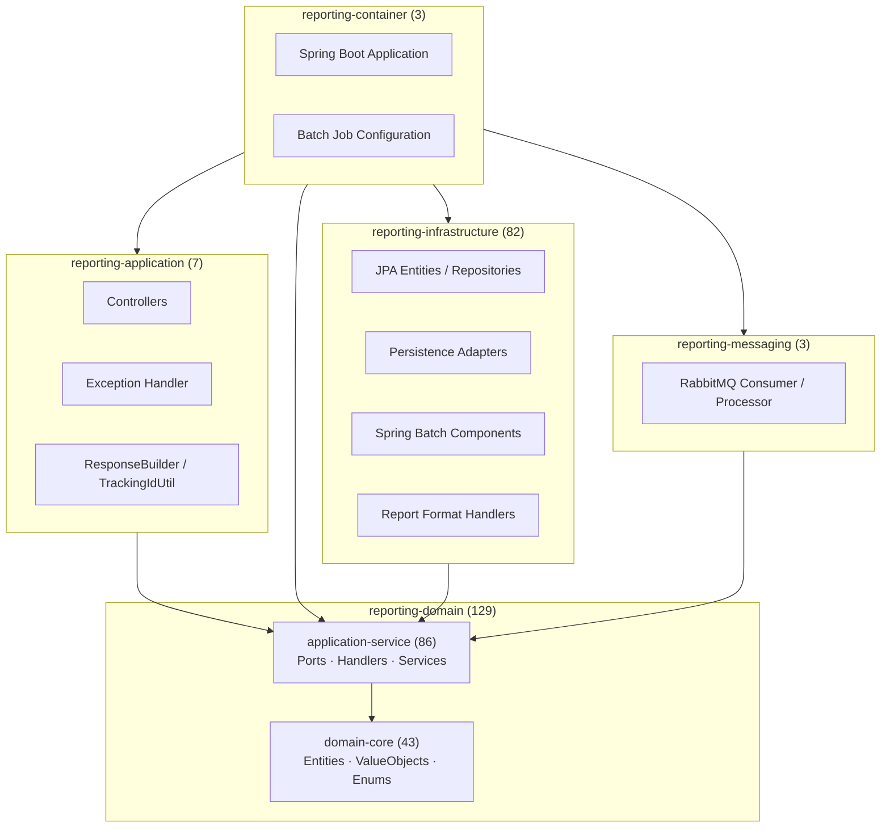

| ماژول | تعداد کلاس | نقش |
|--------|-----------|-----|
| `reporting-application` | 7 | REST Controller، Exception Handler، DTOهای API |
| `reporting-domain/reporting-domain-core` | 43 | Entity، ValueObject، Enum، Exception |
| `reporting-domain/reporting-application-service` | 86 | Port، Service، Handler، Command، Response |
| `reporting-infrastructure` | 82 | JPA، Adapter، Batch، ReportFormat |
| `reporting-messaging` | 3 | RabbitMQ Config، Consumer، Processor |
| `reporting-container` | 3 | Entry Point، Batch Config |

---

## 2. روابط بین لایه‌ها

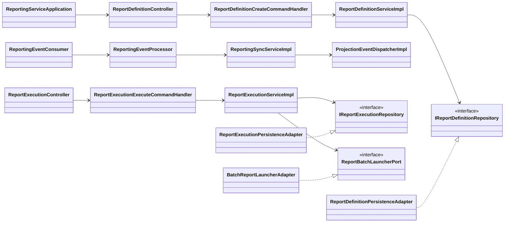

---

## 3. reporting-domain-core — مدل دامنه

### 3.1 سلسله‌مراتب Entity

```mermaid
classDiagram
    direction TB

    class BaseEntity~ID~ {
        <<abstract>>
    }
    class AggregateRoot~ID~ {
        <<abstract>>
    }
    class BaseId~T~ {
        <<abstract>>
    }
    class ProjectionReport {
        <<interface>>
    }

    BaseEntity <|-- AggregateRoot

    AggregateRoot <|-- ReportDefinition
    AggregateRoot <|-- ReportExecution
    AggregateRoot <|-- ReportEvent
    AggregateRoot <|-- PartyReport
    AggregateRoot <|-- CardReport
    AggregateRoot <|-- LoanReport
    AggregateRoot <|-- AccountReport
    AggregateRoot <|-- ProductReport
    AggregateRoot <|-- TransactionReport
    AggregateRoot <|-- InstallmentReport

    BaseEntity <|-- ReportParameter
    BaseEntity <|-- ReportCategory
    BaseEntity <|-- ReportTemplate
    BaseEntity <|-- ReportSchedule
    BaseEntity <|-- ReportFile
    BaseEntity <|-- ReportExecutionDetail

    ProjectionReport <|.. PartyReport
    ProjectionReport <|.. CardReport
    ProjectionReport <|.. LoanReport
    ProjectionReport <|.. AccountReport
    ProjectionReport <|.. ProductReport
    ProjectionReport <|.. TransactionReport
    ProjectionReport <|.. InstallmentReport

    BaseId <|-- ReportDefinitionId
    BaseId <|-- ReportExecutionId
    BaseId <|-- ReportEventId
    BaseId <|-- PartyReportId
    BaseId <|-- CardReportId
    BaseId <|-- LoanReportId
    BaseId <|-- AccountReportId
    BaseId <|-- ProductReportId
    BaseId <|-- TransactionReportId
    BaseId <|-- InstallmentReportId
    BaseId <|-- ReportParameterId
    BaseId <|-- ReportCategoryId
    BaseId <|-- ReportTemplateId
    BaseId <|-- ReportScheduleId
    BaseId <|-- ReportFileId
    BaseId <|-- ReportExecutionDetailId
```

### 3.2 Enum و Exception

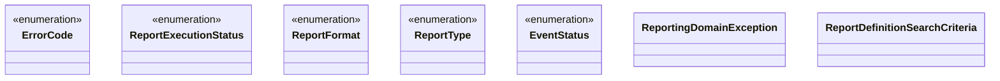

### 3.3 جدول کلاس‌ها — domain-core (43)

| # | نوع | کلاس | پکیج |
|---|-----|------|------|
| 1 | abstract class | `BaseEntity` | `domain.model.entity` |
| 2 | abstract class | `AggregateRoot` | `domain.model.entity` |
| 3 | interface | `ProjectionReport` | `domain.model.entity` |
| 4 | class | `ReportDefinition` | `domain.model.entity` |
| 5 | class | `ReportExecution` | `domain.model.entity` |
| 6 | class | `ReportExecutionDetail` | `domain.model.entity` |
| 7 | class | `ReportEvent` | `domain.model.entity` |
| 8 | class | `ReportParameter` | `domain.model.entity` |
| 9 | class | `ReportCategory` | `domain.model.entity` |
| 10 | class | `ReportTemplate` | `domain.model.entity` |
| 11 | class | `ReportSchedule` | `domain.model.entity` |
| 12 | class | `ReportFile` | `domain.model.entity` |
| 13 | class | `PartyReport` | `domain.model.entity` |
| 14 | class | `CardReport` | `domain.model.entity` |
| 15 | class | `LoanReport` | `domain.model.entity` |
| 16 | class | `AccountReport` | `domain.model.entity` |
| 17 | class | `ProductReport` | `domain.model.entity` |
| 18 | class | `TransactionReport` | `domain.model.entity` |
| 19 | class | `InstallmentReport` | `domain.model.entity` |
| 20 | abstract class | `BaseId` | `domain.model.valueObject` |
| 21 | class | `ReportDefinitionId` | `domain.model.valueObject` |
| 22 | class | `ReportExecutionId` | `domain.model.valueObject` |
| 23 | class | `ReportExecutionDetailId` | `domain.model.valueObject` |
| 24 | class | `ReportEventId` | `domain.model.valueObject` |
| 25 | class | `ReportParameterId` | `domain.model.valueObject` |
| 26 | class | `ReportCategoryId` | `domain.model.valueObject` |
| 27 | class | `ReportTemplateId` | `domain.model.valueObject` |
| 28 | class | `ReportScheduleId` | `domain.model.valueObject` |
| 29 | class | `ReportFileId` | `domain.model.valueObject` |
| 30 | class | `PartyReportId` | `domain.model.valueObject` |
| 31 | class | `CardReportId` | `domain.model.valueObject` |
| 32 | class | `LoanReportId` | `domain.model.valueObject` |
| 33 | class | `AccountReportId` | `domain.model.valueObject` |
| 34 | class | `ProductReportId` | `domain.model.valueObject` |
| 35 | class | `TransactionReportId` | `domain.model.valueObject` |
| 36 | class | `InstallmentReportId` | `domain.model.valueObject` |
| 37 | enum | `ReportExecutionStatus` | `domain.model.enums` |
| 38 | enum | `ReportFormat` | `domain.model.enums` |
| 39 | enum | `ReportType` | `domain.model.enums` |
| 40 | enum | `EventStatus` | `domain.model.enums` |
| 41 | enum | `ErrorCode` | `domain.exception` |
| 42 | class | `ReportingDomainException` | `domain.exception` |
| 43 | class | `ReportDefinitionSearchCriteria` | `domain.model` |

---

## 4. reporting-application-service — Use Cases

### 4.1 Ports (Hexagonal)

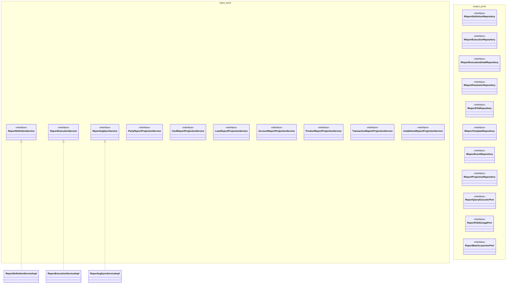

### 4.2 Event Handling

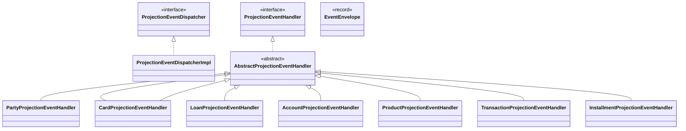

### 4.3 Command Handlers و Controllers

```mermaid
classDiagram
    class ReportDefinitionController
    class ReportExecutionController

    class ReportDefinitionCreateCommandHandler
    class ReportDefinitionUpdateCommandHandler
    class ReportDefinitionDeleteCommandHandler
    class ReportDefinitionFindByIdCommandHandler
    class ReportDefinitionSearchCommandHandler
    class ReportDefinitionStatusUpdateCommandHandler

    class ReportExecutionExecuteCommandHandler
    class ReportExecutionFindByIdCommandHandler
    class ReportExecutionDownloadCommandHandler

    ReportDefinitionController --> ReportDefinitionCreateCommandHandler
    ReportDefinitionController --> ReportDefinitionUpdateCommandHandler
    ReportDefinitionController --> ReportDefinitionDeleteCommandHandler
    ReportDefinitionController --> ReportDefinitionFindByIdCommandHandler
    ReportDefinitionController --> ReportDefinitionSearchCommandHandler
    ReportDefinitionController --> ReportDefinitionStatusUpdateCommandHandler

    ReportExecutionController --> ReportExecutionExecuteCommandHandler
    ReportExecutionController --> ReportExecutionFindByIdCommandHandler
    ReportExecutionController --> ReportExecutionDownloadCommandHandler
```

### 4.4 جدول کلاس‌ها — application-service (86)

| # | لایه | کلاس |
|---|------|------|
| 1 | ports.input | `ReportDefinitionService` |
| 2 | ports.input | `ReportExecutionService` |
| 3 | ports.input | `ReportingSyncService` |
| 4 | ports.input | `PartyReportProjectionService` |
| 5 | ports.input | `CardReportProjectionService` |
| 6 | ports.input | `LoanReportProjectionService` |
| 7 | ports.input | `AccountReportProjectionService` |
| 8 | ports.input | `ProductReportProjectionService` |
| 9 | ports.input | `TransactionReportProjectionService` |
| 10 | ports.input | `InstallmentReportProjectionService` |
| 11 | ports.input.impl | `ReportDefinitionServiceImpl` |
| 12 | ports.input.impl | `ReportExecutionServiceImpl` |
| 13 | ports.input.impl | `ReportingSyncServiceImpl` |
| 14 | ports.input.impl | `PartyReportProjectionServiceImpl` |
| 15 | ports.input.impl | `CardReportProjectionServiceImpl` |
| 16 | ports.input.impl | `LoanReportProjectionServiceImpl` |
| 17 | ports.input.impl | `AccountReportProjectionServiceImpl` |
| 18 | ports.input.impl | `ProductReportProjectionServiceImpl` |
| 19 | ports.input.impl | `TransactionReportProjectionServiceImpl` |
| 20 | ports.input.impl | `InstallmentReportProjectionServiceImpl` |
| 21 | ports.output | `IReportDefinitionRepository` |
| 22 | ports.output | `IReportExecutionRepository` |
| 23 | ports.output | `IReportExecutionDetailRepository` |
| 24 | ports.output | `IReportParameterRepository` |
| 25 | ports.output | `IReportFileRepository` |
| 26 | ports.output | `IReportTemplateRepository` |
| 27 | ports.output | `IReportEventRepository` |
| 28 | ports.output | `IReportProjectionRepository` |
| 29 | ports.output | `ReportQueryExecutorPort` |
| 30 | ports.output | `ReportFileStoragePort` |
| 31 | ports.output | `ReportBatchLauncherPort` |
| 32 | handler.reportdefinition | `ReportDefinitionCreateCommandHandler` |
| 33 | handler.reportdefinition | `ReportDefinitionUpdateCommandHandler` |
| 34 | handler.reportdefinition | `ReportDefinitionDeleteCommandHandler` |
| 35 | handler.reportdefinition | `ReportDefinitionFindByIdCommandHandler` |
| 36 | handler.reportdefinition | `ReportDefinitionSearchCommandHandler` |
| 37 | handler.reportdefinition | `ReportDefinitionStatusUpdateCommandHandler` |
| 38 | handler.reportexecution | `ReportExecutionExecuteCommandHandler` |
| 39 | handler.reportexecution | `ReportExecutionFindByIdCommandHandler` |
| 40 | handler.reportexecution | `ReportExecutionDownloadCommandHandler` |
| 41 | command.reportdefinition | `CreateReportDefinitionCommand` |
| 42 | command.reportdefinition | `UpdateReportDefinitionCommand` |
| 43 | command.reportdefinition | `DeleteReportDefinitionCommand` |
| 44 | command.reportdefinition | `FindReportDefinitionByIdCommand` |
| 45 | command.reportdefinition | `SearchReportDefinitionCommand` |
| 46 | command.reportdefinition | `UpdateReportDefinitionStatusCommand` |
| 47 | command.reportexecution | `ExecuteReportCommand` |
| 48 | command.reportexecution | `FindReportExecutionByIdCommand` |
| 49 | command.common | `PagedSearchCommand` |
| 50 | response.reportdefinition | `CreateReportDefinitionResponse` |
| 51 | response.reportdefinition | `UpdateReportDefinitionResponse` |
| 52 | response.reportdefinition | `DeleteReportDefinitionResponse` |
| 53 | response.reportdefinition | `FindReportDefinitionResponse` |
| 54 | response.reportdefinition | `SearchReportDefinitionResponse` |
| 55 | response.reportexecution | `ExecuteReportResponse` |
| 56 | response.reportexecution | `FindReportExecutionResponse` |
| 57 | response.reportexecution | `ReportFileDownloadResponse` |
| 58 | mapper | `ReportDefinitionMapper` |
| 59 | mapper | `ReportExecutionMapper` |
| 60 | mapper | `ReportingProjectionMapper` |
| 61 | event.dispacher | `ProjectionEventDispatcher` |
| 62 | event.dispacher.impl | `ProjectionEventDispatcherImpl` |
| 63 | event.handler | `ProjectionEventHandler` |
| 64 | event.handler | `AbstractProjectionEventHandler` |
| 65 | event.handler | `PartyProjectionEventHandler` |
| 66 | event.handler | `CardProjectionEventHandler` |
| 67 | event.handler | `LoanProjectionEventHandler` |
| 68 | event.handler | `AccountProjectionEventHandler` |
| 69 | event.handler | `ProductProjectionEventHandler` |
| 70 | event.handler | `TransactionProjectionEventHandler` |
| 71 | event.handler | `InstallmentProjectionEventHandler` |
| 72 | event.model | `EventEnvelope` |
| 73 | reportexecution | `ReportExecutionUrlFactory` |
| 74 | reportexecution | `ReportParameterBindingService` |
| 75 | reportexecution | `ReportSqlGuard` |
| 76 | reportbatch.service | `ReportBatchContextFactory` |
| 77 | reportbatch.service | `ReportBatchFormatResolver` |
| 78 | reportbatch.model | `ReportBatchContext` |
| 79 | reportbatch.model | `ReportBatchLaunchRequest` |
| 80 | reportbatch.model | `ReportBatchJobParameterKeys` |
| 81 | reportbatch.model | `ReportBatchSharedStateKeys` |
| 82 | reportbatch.contract | `ReportBatchReader` |
| 83 | reportbatch.contract | `ReportBatchProcessor` |
| 84 | reportbatch.contract | `ReportBatchWriter` |
| 85 | utility | `EventPayloadReader` |
| 86 | utility | `ProjectionPayloadSerializer` |

---

## 5. reporting-application — REST API

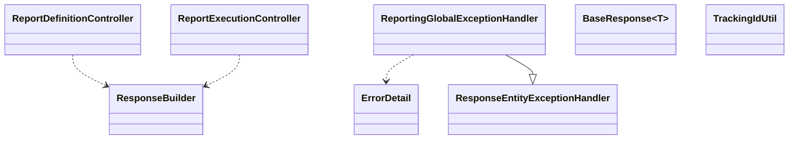

| # | کلاس | پکیج |
|---|------|------|
| 1 | `ReportDefinitionController` | `application.rest.reportdefinition` |
| 2 | `ReportExecutionController` | `application.rest.reportexecution` |
| 3 | `ReportingGlobalExceptionHandler` | `application.exception.handler` |
| 4 | `BaseResponse` | `application.response` |
| 5 | `ErrorDetail` | `application.response` |
| 6 | `ResponseBuilder` | `application.util` |
| 7 | `TrackingIdUtil` | `application.util` |

---

## 6. reporting-infrastructure — JPA و Adapter

### 6.1 Persistence Adapters

```mermaid
classDiagram
    class IReportDefinitionRepository {
        <<interface>>
    }
    class IReportExecutionRepository {
        <<interface>>
    }
    class IReportProjectionRepository {
        <<interface>>
    }
    class IReportEventRepository {
        <<interface>>
    }
    class ReportBatchLauncherPort {
        <<interface>>
    }
    class ReportQueryExecutorPort {
        <<interface>>
    }
    class ReportFileStoragePort {
        <<interface>>
    }

    class ReportDefinitionPersistenceAdapter
    class ReportExecutionPersistenceAdapter
    class ReportExecutionDetailPersistenceAdapter
    class ReportParameterPersistenceAdapter
    class ReportFilePersistenceAdapter
    class ReportTemplatePersistenceAdapter
    class IReportProjectionPersistenceAdapter
    class IReportEventPersistenceAdapter
    class ReportQueryExecutorAdapter
    class LocalReportFileStorageAdapter
    class BatchReportLauncherAdapter

    IReportDefinitionRepository <|.. ReportDefinitionPersistenceAdapter
    IReportExecutionRepository <|.. ReportExecutionPersistenceAdapter
    IReportProjectionRepository <|.. IReportProjectionPersistenceAdapter
    IReportEventRepository <|.. IReportEventPersistenceAdapter
    ReportQueryExecutorPort <|.. ReportQueryExecutorAdapter
    ReportFileStoragePort <|.. LocalReportFileStorageAdapter
    ReportBatchLauncherPort <|.. BatchReportLauncherAdapter
```

### 6.2 JPA Entity Hierarchy

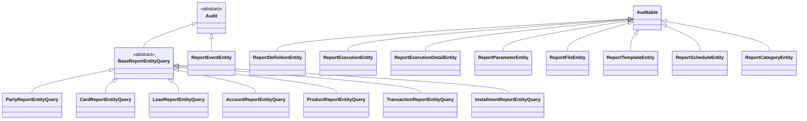

### 6.3 Batch و ReportFormat

```mermaid
classDiagram
    class ReportBatchReader {
        <<interface>>
    }
    class ReportBatchProcessor {
        <<interface>>
    }
    class ReportBatchWriter {
        <<interface>>
    }
    class ReportFormatHandler {
        <<interface>>
    }

    class JdbcReportBatchReader
    class GenericReportBatchProcessor
    class GenericReportBatchWriter
    class BatchReportLauncherAdapter
    class ReportBatchStepCompletionListener
    class ReportBatchSharedStateRegistry
    class ReportBatchComponentRegistry
    class DelegatingReportItemReader
    class DelegatingReportItemProcessor
    class DelegatingReportItemWriter
    class ReportJdbcValueConverter

    class JsonReportFormatHandler
    class CsvReportFormatHandler
    class ReportFormatHandlerRegistry
    class ReportFormatService
    class ReportFormatRequest
    class ReportFormatResult
    class ReportFormatColumn
    class ReportTemplateColumnResolver

    ReportBatchReader <|.. JdbcReportBatchReader
    ReportBatchProcessor <|.. GenericReportBatchProcessor
    ReportBatchWriter <|.. GenericReportBatchWriter
    ReportFormatHandler <|.. JsonReportFormatHandler
    ReportFormatHandler <|.. CsvReportFormatHandler
```

### 6.4 جدول کلاس‌ها — infrastructure (82)

| # | گروه | کلاس |
|---|------|------|
| 1-9 | adapter | `ReportDefinitionPersistenceAdapter`, `ReportExecutionPersistenceAdapter`, `ReportExecutionDetailPersistenceAdapter`, `ReportParameterPersistenceAdapter`, `ReportFilePersistenceAdapter`, `ReportTemplatePersistenceAdapter`, `IReportProjectionPersistenceAdapter`, `IReportEventPersistenceAdapter`, `ReportQueryExecutorAdapter`, `LocalReportFileStorageAdapter` |
| 10-21 | entity.command | `ReportDefinitionEntity`, `ReportExecutionEntity`, `ReportExecutionDetailEntity`, `ReportParameterEntity`, `ReportFileEntity`, `ReportTemplateEntity`, `ReportScheduleEntity`, `ReportCategoryEntity` |
| 22-30 | entity.query | `BaseReportEntityQuery`, `PartyReportEntityQuery`, `CardReportEntityQuery`, `LoanReportEntityQuery`, `AccountReportEntityQuery`, `ProductReportEntityQuery`, `TransactionReportEntityQuery`, `InstallmentReportEntityQuery`, `ReportEventEntity` |
| 31-32 | entity | `Audit`, `Auditable` |
| 33-52 | repository | `ReportDefinitionRepository`, `ReportExecutionRepository`, `ReportExecutionDetailRepository`, `ReportParameterRepository`, `ReportFileRepository`, `ReportTemplateRepository`, `ReportScheduleRepository`, `ReportEventRepository`, `PartyReportRepository`, `CardReportRepository`, `LoanReportRepository`, `AccountReportRepository`, `ProductReportRepository`, `TransactionReportRepository`, `InstallmentReportRepository` |
| 53-68 | mapper | `ReportDefinitionDataAccessMapper`, `ReportExecutionDataAccessMapper`, `ReportExecutionDetailDataAccessMapper`, `ReportParameterDataAccessMapper`, `ReportFileDataAccessMapper`, `ReportTemplateDataAccessMapper`, `ReportScheduleDataAccessMapper`, `ReportCategoryDataAccessMapper`, `ReportEventDataAccessMapper`, `PartyReportDataAccessMapper`, `CardReportDataAccessMapper`, `LoanReportDataAccessMapper`, `AccountReportDataAccessMapper`, `ProductReportDataAccessMapper`, `TransactionReportDataAccessMapper`, `InstallmentReportDataAccessMapper` |
| 69 | specification | `ReportDefinitionSpecification` |
| 70 | scheduler | `ReportScheduleExecutionJob` |
| 71-82 | batch | `BatchReportLauncherAdapter`, `JdbcReportBatchReader`, `GenericReportBatchProcessor`, `GenericReportBatchWriter`, `ReportBatchStepCompletionListener`, `ReportBatchSharedStateRegistry`, `ReportBatchComponentRegistry`, `DelegatingReportItemReader`, `DelegatingReportItemProcessor`, `DelegatingReportItemWriter`, `ReportJdbcValueConverter` |
| 83-91 | reportformat | `ReportFormatHandler`, `JsonReportFormatHandler`, `CsvReportFormatHandler`, `ReportFormatHandlerRegistry`, `ReportFormatService`, `ReportFormatRequest`, `ReportFormatResult`, `ReportFormatColumn`, `ReportTemplateColumnResolver` |

---

## 7. reporting-messaging — RabbitMQ

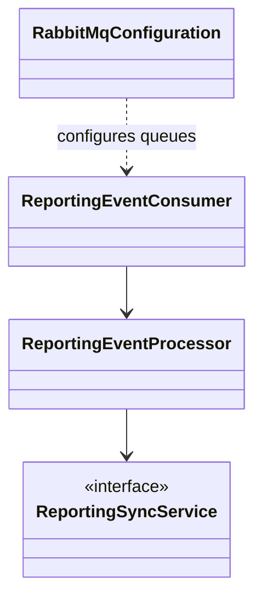

| # | کلاس | پکیج |
|---|------|------|
| 1 | `RabbitMqConfiguration` | `messaging.config` |
| 2 | `ReportingEventConsumer` | `messaging.consumer` |
| 3 | `ReportingEventProcessor` | `messaging.processor` |

---

## 8. reporting-container — Bootstrap

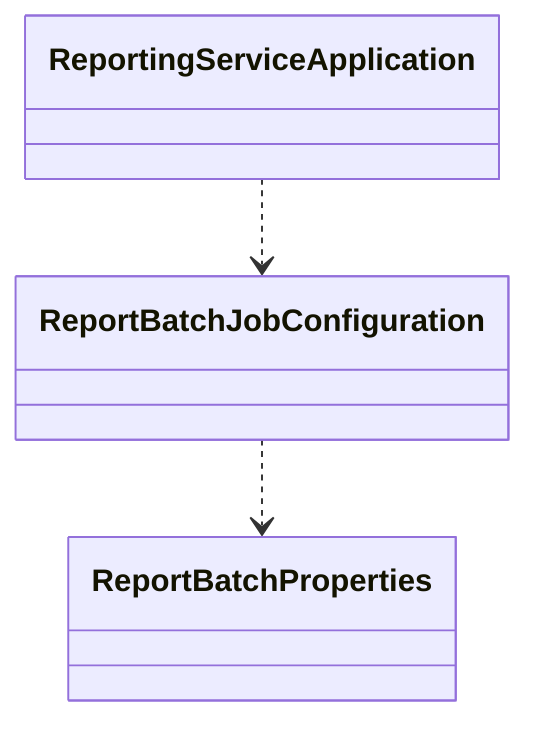

| # | کلاس | پکیج |
|---|------|------|
| 1 | `ReportingServiceApplication` | `com.sample.system.reporting.service` |
| 2 | `ReportBatchJobConfiguration` | `batch` |
| 3 | `ReportBatchProperties` | `batch` |

---

## 9. فهرست کامل کلاس‌ها

### reporting-application (7)

`BaseResponse`, `ErrorDetail`, `ReportingGlobalExceptionHandler`, `ReportDefinitionController`, `ReportExecutionController`, `ResponseBuilder`, `TrackingIdUtil`

### reporting-container (3)

`ReportingServiceApplication`, `ReportBatchJobConfiguration`, `ReportBatchProperties`

### reporting-messaging (3)

`RabbitMqConfiguration`, `ReportingEventConsumer`, `ReportingEventProcessor`

### reporting-domain-core (43)

`AccountReport`, `AccountReportId`, `AggregateRoot`, `BaseEntity`, `BaseId`, `CardReport`, `CardReportId`, `ErrorCode`, `EventStatus`, `InstallmentReport`, `InstallmentReportId`, `LoanReport`, `LoanReportId`, `PartyReport`, `PartyReportId`, `ProductReport`, `ProductReportId`, `ProjectionReport`, `ReportCategory`, `ReportCategoryId`, `ReportDefinition`, `ReportDefinitionId`, `ReportDefinitionSearchCriteria`, `ReportEvent`, `ReportEventId`, `ReportExecution`, `ReportExecutionDetail`, `ReportExecutionDetailId`, `ReportExecutionId`, `ReportExecutionStatus`, `ReportFile`, `ReportFileId`, `ReportFormat`, `ReportParameter`, `ReportParameterId`, `ReportSchedule`, `ReportScheduleId`, `ReportTemplate`, `ReportTemplateId`, `ReportType`, `ReportingDomainException`, `TransactionReport`, `TransactionReportId`

### reporting-application-service (86)

`AbstractProjectionEventHandler`, `AccountProjectionEventHandler`, `AccountReportProjectionService`, `AccountReportProjectionServiceImpl`, `CardProjectionEventHandler`, `CardReportProjectionService`, `CardReportProjectionServiceImpl`, `CreateReportDefinitionCommand`, `CreateReportDefinitionResponse`, `DeleteReportDefinitionCommand`, `DeleteReportDefinitionResponse`, `EventEnvelope`, `EventPayloadReader`, `ExecuteReportCommand`, `ExecuteReportResponse`, `FindReportDefinitionByIdCommand`, `FindReportDefinitionResponse`, `FindReportExecutionByIdCommand`, `FindReportExecutionResponse`, `InstallmentProjectionEventHandler`, `InstallmentReportProjectionService`, `InstallmentReportProjectionServiceImpl`, `IReportDefinitionRepository`, `IReportEventRepository`, `IReportExecutionDetailRepository`, `IReportExecutionRepository`, `IReportFileRepository`, `IReportParameterRepository`, `IReportProjectionRepository`, `IReportTemplateRepository`, `LoanProjectionEventHandler`, `LoanReportProjectionService`, `LoanReportProjectionServiceImpl`, `PagedSearchCommand`, `PartyProjectionEventHandler`, `PartyReportProjectionService`, `PartyReportProjectionServiceImpl`, `ProductProjectionEventHandler`, `ProductReportProjectionService`, `ProductReportProjectionServiceImpl`, `ProjectionEventDispatcher`, `ProjectionEventDispatcherImpl`, `ProjectionEventHandler`, `ProjectionPayloadSerializer`, `ReportBatchContext`, `ReportBatchContextFactory`, `ReportBatchFormatResolver`, `ReportBatchJobParameterKeys`, `ReportBatchLaunchRequest`, `ReportBatchLauncherPort`, `ReportBatchProcessor`, `ReportBatchReader`, `ReportBatchSharedStateKeys`, `ReportBatchWriter`, `ReportDefinitionCreateCommandHandler`, `ReportDefinitionDeleteCommandHandler`, `ReportDefinitionFindByIdCommandHandler`, `ReportDefinitionMapper`, `ReportDefinitionSearchCommandHandler`, `ReportDefinitionService`, `ReportDefinitionServiceImpl`, `ReportDefinitionStatusUpdateCommandHandler`, `ReportDefinitionUpdateCommandHandler`, `ReportExecutionDownloadCommandHandler`, `ReportExecutionExecuteCommandHandler`, `ReportExecutionFindByIdCommandHandler`, `ReportExecutionMapper`, `ReportExecutionService`, `ReportExecutionServiceImpl`, `ReportExecutionUrlFactory`, `ReportFileDownloadResponse`, `ReportFileStoragePort`, `ReportParameterBindingService`, `ReportingProjectionMapper`, `ReportingSyncService`, `ReportingSyncServiceImpl`, `ReportQueryExecutorPort`, `ReportSqlGuard`, `SearchReportDefinitionCommand`, `SearchReportDefinitionResponse`, `TransactionProjectionEventHandler`, `TransactionReportProjectionService`, `TransactionReportProjectionServiceImpl`, `UpdateReportDefinitionCommand`, `UpdateReportDefinitionResponse`, `UpdateReportDefinitionStatusCommand`

### reporting-infrastructure (82)

`AccountReportDataAccessMapper`, `AccountReportEntityQuery`, `AccountReportRepository`, `Audit`, `Auditable`, `BaseReportEntityQuery`, `BatchReportLauncherAdapter`, `CardReportDataAccessMapper`, `CardReportEntityQuery`, `CardReportRepository`, `CsvReportFormatHandler`, `DelegatingReportItemProcessor`, `DelegatingReportItemReader`, `DelegatingReportItemWriter`, `GenericReportBatchProcessor`, `GenericReportBatchWriter`, `InstallmentReportDataAccessMapper`, `InstallmentReportEntityQuery`, `InstallmentReportRepository`, `IReportEventPersistenceAdapter`, `IReportProjectionPersistenceAdapter`, `JdbcReportBatchReader`, `JsonReportFormatHandler`, `LoanReportDataAccessMapper`, `LoanReportEntityQuery`, `LoanReportRepository`, `LocalReportFileStorageAdapter`, `PartyReportDataAccessMapper`, `PartyReportEntityQuery`, `PartyReportRepository`, `ProductReportDataAccessMapper`, `ProductReportEntityQuery`, `ProductReportRepository`, `ReportBatchComponentRegistry`, `ReportBatchSharedStateRegistry`, `ReportBatchStepCompletionListener`, `ReportCategoryDataAccessMapper`, `ReportCategoryEntity`, `ReportDefinitionDataAccessMapper`, `ReportDefinitionEntity`, `ReportDefinitionPersistenceAdapter`, `ReportDefinitionRepository`, `ReportDefinitionSpecification`, `ReportEventDataAccessMapper`, `ReportEventEntity`, `ReportEventRepository`, `ReportExecutionDataAccessMapper`, `ReportExecutionDetailDataAccessMapper`, `ReportExecutionDetailEntity`, `ReportExecutionDetailPersistenceAdapter`, `ReportExecutionDetailRepository`, `ReportExecutionEntity`, `ReportExecutionPersistenceAdapter`, `ReportExecutionRepository`, `ReportFileDataAccessMapper`, `ReportFileEntity`, `ReportFilePersistenceAdapter`, `ReportFileRepository`, `ReportFormatColumn`, `ReportFormatHandler`, `ReportFormatHandlerRegistry`, `ReportFormatRequest`, `ReportFormatResult`, `ReportFormatService`, `ReportJdbcValueConverter`, `ReportParameterDataAccessMapper`, `ReportParameterEntity`, `ReportParameterPersistenceAdapter`, `ReportParameterRepository`, `ReportQueryExecutorAdapter`, `ReportScheduleDataAccessMapper`, `ReportScheduleEntity`, `ReportScheduleExecutionJob`, `ReportScheduleRepository`, `ReportTemplateColumnResolver`, `ReportTemplateDataAccessMapper`, `ReportTemplateEntity`, `ReportTemplatePersistenceAdapter`, `ReportTemplateRepository`, `TransactionReportDataAccessMapper`, `TransactionReportEntityQuery`, `TransactionReportRepository`

---

## راهنمای مشاهده

- این فایل با **Mermaid** نوشته شده و در GitHub، GitLab، VS Code (با افزونه Mermaid) و Cursor به‌صورت گرافیکی رندر می‌شود.
- برای بازتولید خودکار: `node scripts/generate-class-diagram-md.mjs`
- تاریخ تولید: 2026-06-22
